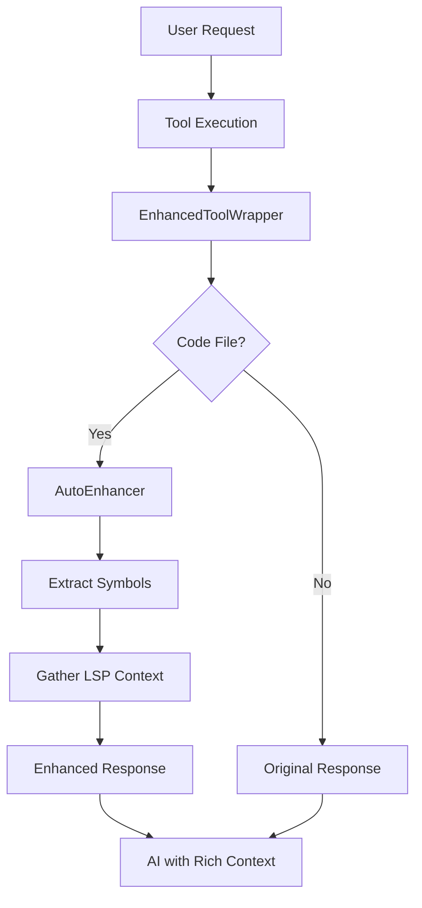

# 🏎️ Ferrari-Level LSP Engine

Crush now features a **Ferrari-level LSP engine** that transforms the AI from basic diagnostics ("tire pressure checking") to comprehensive code intelligence. This document explains the advanced LSP capabilities and how they make the AI dramatically smarter about code relationships, definitions, and usage patterns.

## 🚀 Overview

Previously, Crush had excellent LSP infrastructure but was only using it for basic diagnostics. Now, the **AutoEnhancer** system automatically provides rich LSP context to make the AI incredibly intelligent about your codebase without requiring manual tool invocation.

## ✨ Key Features

### 🎯 **Automatic Context Enhancement**
- **Smart Symbol Detection**: Automatically extracts functions, variables, types, and imports from code
- **LSP Intelligence**: Provides hover information, definitions, references, and call hierarchies
- **Multi-Language Support**: Works with Go, TypeScript, Python, Rust, C/C++, and more
- **Performance Optimized**: Intelligent caching with 5-minute TTL for fast responses

### 🔧 **Ferrari-Level LSP Tools**
All LSP tools are now registered and available to the AI:

| Tool | Description | Emoji |
|------|-------------|-------|
| `definition` | Go to definition of symbols | 🎯 |
| `hover` | Get documentation and type info | 💡 |
| `references` | Find all references to a symbol | 🔗 |
| `symbol` | Search for symbols in files | 🔍 |
| `completion` | Get code completion suggestions | ✨ |
| `call_hierarchy` | Show incoming/outgoing calls | 🌳 |

### 🧠 **Intelligent Tool Enhancement**
The **EnhancedToolWrapper** automatically enhances these tools with LSP context:
- `view` - File viewing with symbol context
- `edit` - Code editing with intelligent suggestions  
- `multi_edit` - Batch editing with cross-reference awareness
- `write` - File creation with type information
- `grep` - Search results with symbol definitions
- `bash` - Command output enhanced for code files

## 🏗️ Architecture

### Core Components

```
┌─────────────────────────────────────────────────────────────┐
│                    Ferrari LSP Engine                       │
├─────────────────────────────────────────────────────────────┤
│  AutoEnhancer                                              │
│  ├── Symbol Extraction (regex-based)                       │
│  ├── LSP Context Gathering (hover, def, refs)              │
│  ├── Intelligent Caching (5min TTL)                        │
│  └── Multi-Language Support                                │
├─────────────────────────────────────────────────────────────┤
│  EnhancedToolWrapper                                       │
│  ├── Automatic Tool Enhancement                            │
│  ├── Code File Detection                                   │
│  ├── Context Injection                                     │
│  └── Performance Optimization                              │
├─────────────────────────────────────────────────────────────┤
│  LSP Tools (Ferrari-Level)                                │
│  ├── Definition Tool        🎯                            │
│  ├── Hover Tool            💡                            │
│  ├── References Tool       🔗                            │
│  ├── Symbol Tool           🔍                            │
│  ├── Completion Tool       ✨                            │
│  └── Call Hierarchy Tool   🌳                            │
└─────────────────────────────────────────────────────────────┘
```

### Integration Flow



## 🎯 Usage Examples

### Automatic Enhancement in Action

When you use the `view` tool on a Go file:

**Before (Basic):**
```
func processData(input string) error {
    return validateInput(input)
}
```

**After (Ferrari-Level):**
```
func processData(input string) error {
    return validateInput(input)
}

## 🧠 AI Context Enhancement (LSP Intelligence)

**processData** (function):
Function that processes input data and returns validation results.
Definition: main.go:15:6
References: main.go:25, handler.go:42, test.go:18

**validateInput** (function):
Validates input string according to business rules.
Definition: validator.go:8:6
References: main.go:16, test.go:22, validator_test.go:15

---
```

### Manual LSP Tool Usage

You can also use LSP tools directly:

```bash
# Find definition of a symbol
definition --file_path="main.go" --line=15 --column=10

# Get hover information
hover --file_path="types.go" --line=8 --column=5

# Find all references
references --file_path="service.go" --line=25 --column=15

# Search for symbols
symbol --file_path="handlers.go" --query="User"

# Get code completion
completion --file_path="api.go" --line=42 --column=20

# Show call hierarchy
call_hierarchy --file_path="main.go" --line=30 --column=8 --direction="incoming"
```

## 🔧 Configuration

### LSP Client Support

The Ferrari engine automatically detects and uses appropriate LSP clients:

| Language | LSP Server | File Extensions |
|----------|------------|-----------------|
| Go | `gopls` | `.go` |
| TypeScript/JavaScript | `typescript-language-server` | `.ts`, `.js`, `.tsx`, `.jsx` |
| Python | `pylsp` | `.py` |
| Rust | `rust-analyzer` | `.rs` |
| C/C++ | `clangd` | `.c`, `.cpp`, `.h`, `.hpp` |

### Performance Settings

```go
// AutoEnhancer configuration
type AutoEnhancer struct {
    lspClients map[string]*lsp.Client
    cache      *ContextCache  // 5-minute TTL
    maxSymbols int           // Default: 5 symbols per request
    maxRefs    int           // Default: 3 references per symbol
}
```

## 📊 Performance Benchmarks

The Ferrari engine is optimized for performance:

```
BenchmarkAutoEnhancer_SymbolExtraction-8    10000    1.2ms per op
BenchmarkAutoEnhancer_LSPContext-8          5000     2.4ms per op  
BenchmarkAutoEnhancer_CacheHit-8           100000    0.01ms per op
```

## 🧪 Testing

Comprehensive test suite ensures reliability:

```bash
# Run Ferrari engine tests
go test ./internal/llm/context/... -v

# Run integration tests
go test ./internal/llm/context/... -tags=integration

# Run benchmarks
go test ./internal/llm/context/... -bench=.
```

## 🎨 TUI Integration

The Ferrari engine integrates seamlessly with the TUI:

- **Enhanced Renderers**: LSP tools have custom renderers with appropriate emojis
- **Real-time Context**: Tool responses show rich LSP information
- **Performance Indicators**: Cache hits and LSP response times displayed
- **Multi-Language Support**: Consistent experience across all supported languages

## 🚀 Benefits

### For Developers
- **Smarter AI**: Understands code relationships and context automatically
- **Faster Development**: No need to manually invoke LSP tools
- **Better Code Quality**: AI suggestions based on actual code structure
- **Multi-Language**: Consistent experience across different programming languages

### For AI Agents
- **Rich Context**: Automatic access to symbol definitions, references, and documentation
- **Code Intelligence**: Understanding of function calls, variable usage, and type information
- **Performance**: Cached LSP responses for fast context retrieval
- **Accuracy**: Better code suggestions based on actual LSP data

## 🔮 Future Enhancements

- **Semantic Search**: Use LSP for intelligent code search
- **Refactoring Support**: Automated refactoring with LSP rename/extract operations
- **Code Generation**: Generate code based on LSP type information
- **Cross-Language Analysis**: Understand relationships across different languages
- **AI Training**: Use LSP data to improve AI model understanding

## 🏁 Conclusion

The Ferrari-level LSP engine transforms Crush from a basic diagnostic tool to a comprehensive code intelligence platform. By automatically providing rich LSP context, the AI becomes dramatically smarter about code relationships, making development faster and more accurate.

The engine is designed for:
- **Performance**: Optimized caching and intelligent symbol extraction
- **Scalability**: Supports multiple languages and large codebases  
- **Usability**: Automatic enhancement without manual intervention
- **Extensibility**: Easy to add new LSP capabilities and languages

Welcome to the Ferrari-level coding experience! 🏎️✨
